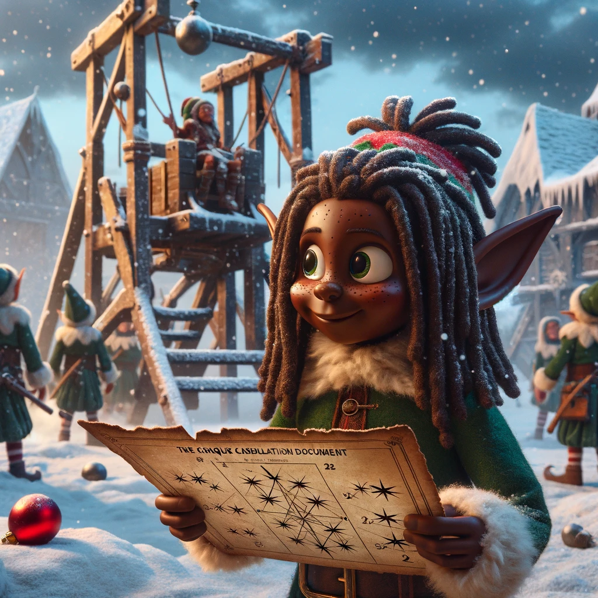
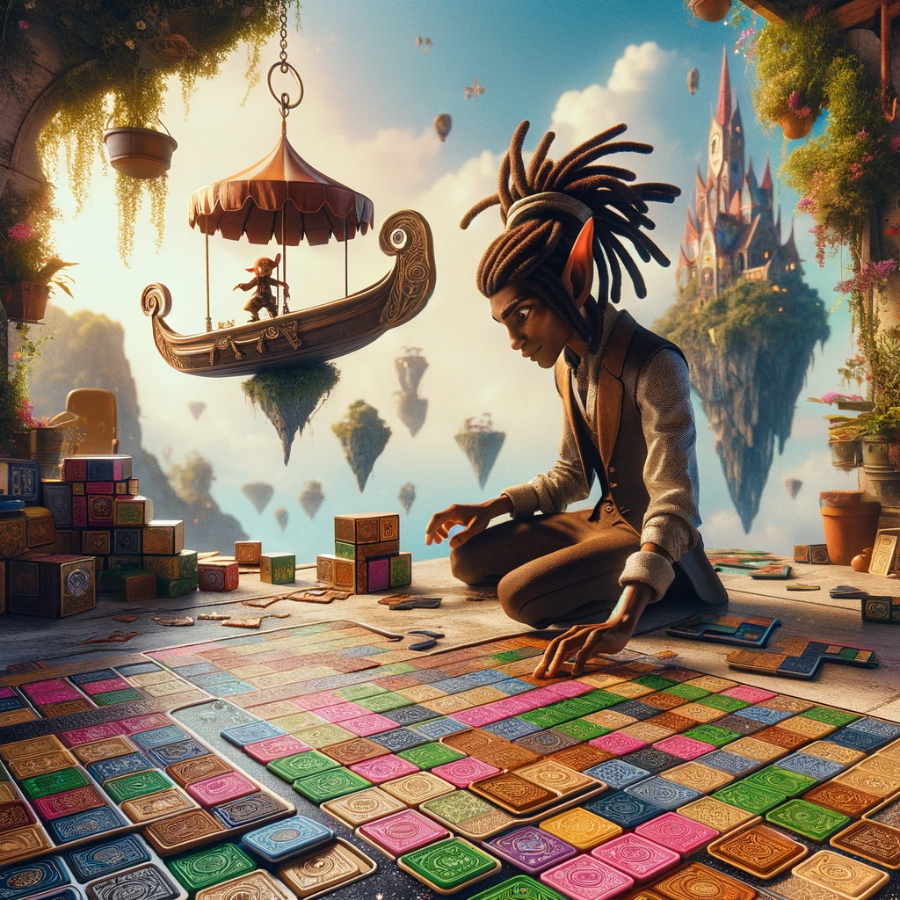

# Day 1: Trebuchet?!

Something is wrong with global snow production, and you've been selected to take a look. The Elves have even given you a map; on it, they've used stars to mark the top fifty locations that are likely to be having problems.

You've been doing this long enough to know that to restore snow operations, you need to check all fifty stars by December 25th.

Collect stars by solving puzzles. Two puzzles will be made available on each day in the Advent calendar; the second puzzle is unlocked when you complete the first. Each puzzle grants one star. Good luck!

You try to ask why they can't just use a weather machine ("not powerful enough") and where they're even sending you ("the sky") and why your map looks mostly blank ("you sure ask a lot of questions") and hang on did you just say the sky ("of course, where do you think snow comes from") when you realize that the Elves are already loading you into a trebuchet ("please hold still, we need to strap you in").

As they're making the final adjustments, they discover that their calibration document (your puzzle input) has been amended by a very young Elf who was apparently just excited to show off her art skills. Consequently, the Elves are having trouble reading the values on the document.

The newly-improved calibration document consists of lines of text; each line originally contained a specific calibration value that the Elves now need to recover. On each line, the calibration value can be found by combining the first digit and the last digit (in that order) to form a single two-digit number.

For example:

- 1abc2
- pqr3stu8vwx
- a1b2c3d4e5f
- treb7uchet

In this example, the calibration values of these four lines are 12, 38, 15, and 77. Adding these together produces 142.
Consider your entire calibration document. What is the sum of all of the calibration values?

## Part Two

Your calculation isn't quite right. It looks like some of the digits are actually spelled out with letters: one, two, three, four, five, six, seven, eight, and nine also count as valid "digits".

Equipped with this new information, you now need to find the real first and last digit on each line. For example:

- two1nine
- eightwothree
- abcone2threexyz
- xtwone3four
- 4nineeightseven2
- zoneight234
- 7pqrstsixteen

In this example, the calibration values are 29, 83, 13, 24, 42, 14, and 76. Adding these together produces 281.
What is the sum of all of the calibration values?

---

# Day 2: Cube Conundrum

You're launched high into the atmosphere! The apex of your trajectory just barely reaches the surface of a large island floating in the sky. You gently land in a fluffy pile of leaves. It's quite cold, but you don't see much snow. An Elf runs over to greet you.

The Elf explains that you've arrived at Snow Island and apologizes for the lack of snow. He'll be happy to explain the situation, but it's a bit of a walk, so you have some time. They don't get many visitors up here; would you like to play a game in the meantime?

As you walk, the Elf shows you a small bag and some cubes which are either red, green, or blue. Each time you play this game, he will hide a secret number of cubes of each color in the bag, and your goal is to figure out information about the number of cubes.

To get information, once a bag has been loaded with cubes, the Elf will reach into the bag, grab a handful of random cubes, show them to you, and then put them back in the bag. He'll do this a few times per game.

You play several games and record the information from each game (your puzzle input). Each game is listed with its ID number (like the 11 in Game 11: ...) followed by a semicolon-separated list of subsets of cubes that were revealed from the bag (like 3 red, 5 green, 4 blue).

For example, the record of a few games might look like this:

Game 1: 3 blue, 4 red; 1 red, 2 green, 6 blue; 2 green
Game 2: 1 blue, 2 green; 3 green, 4 blue, 1 red; 1 green, 1 blue
Game 3: 8 green, 6 blue, 20 red; 5 blue, 4 red, 13 green; 5 green, 1 red
Game 4: 1 green, 3 red, 6 blue; 3 green, 6 red; 3 green, 15 blue, 14 red
Game 5: 6 red, 1 blue, 3 green; 2 blue, 1 red, 2 green
In game 1, three sets of cubes are revealed from the bag (and then put back again). The first set is 3 blue cubes and 4 red cubes; the second set is 1 red cube, 2 green cubes, and 6 blue cubes; the third set is only 2 green cubes.

The Elf would first like to know which games would have been possible if the bag contained only 12 red cubes, 13 green cubes, and 14 blue cubes?

In the example above, games 1, 2, and 5 would have been possible if the bag had been loaded with that configuration. However, game 3 would have been impossible because at one point the Elf showed you 20 red cubes at once; similarly, game 4 would also have been impossible because the Elf showed you 15 blue cubes at once. If you add up the IDs of the games that would have been possible, you get 8.

Determine which games would have been possible if the bag had been loaded with only 12 red cubes, 13 green cubes, and 14 blue cubes. What is the sum of the IDs of those games?

--- Part Two ---

The Elf says they've stopped producing snow because they aren't getting any water! He isn't sure why the water stopped; however, he can show you how to get to the water source to check it out for yourself. It's just up ahead!

As you continue your walk, the Elf poses a second question: in each game you played, what is the fewest number of cubes of each color that could have been in the bag to make the game possible?

Again consider the example games from earlier:

Game 1: 3 blue, 4 red; 1 red, 2 green, 6 blue; 2 green
Game 2: 1 blue, 2 green; 3 green, 4 blue, 1 red; 1 green, 1 blue
Game 3: 8 green, 6 blue, 20 red; 5 blue, 4 red, 13 green; 5 green, 1 red
Game 4: 1 green, 3 red, 6 blue; 3 green, 6 red; 3 green, 15 blue, 14 red
Game 5: 6 red, 1 blue, 3 green; 2 blue, 1 red, 2 green
In game 1, the game could have been played with as few as 4 red, 2 green, and 6 blue cubes. If any color had even one fewer cube, the game would have been impossible.
Game 2 could have been played with a minimum of 1 red, 3 green, and 4 blue cubes.
Game 3 must have been played with at least 20 red, 13 green, and 6 blue cubes.
Game 4 required at least 14 red, 3 green, and 15 blue cubes.
Game 5 needed no fewer than 6 red, 3 green, and 2 blue cubes in the bag.
The power of a set of cubes is equal to the numbers of red, green, and blue cubes multiplied together. The power of the minimum set of cubes in game 1 is 48. In games 2-5 it was 12, 1560, 630, and 36, respectively. Adding up these five powers produces the sum 2286.

For each game, find the minimum set of cubes that must have been present. What is the sum of the power of these sets?

---

## Day 3: Gear Ratios

You and the Elf eventually reach a gondola lift station; he says the gondola lift will take you up to the water source, but this is as far as he can bring you. You go inside.

It doesn't take long to find the gondolas, but there seems to be a problem: they're not moving.

"Aaah!"

You turn around to see a slightly-greasy Elf with a wrench and a look of surprise. "Sorry, I wasn't expecting anyone! The gondola lift isn't working right now; it'll still be a while before I can fix it." You offer to help.

The engineer explains that an engine part seems to be missing from the engine, but nobody can figure out which one. If you can add up all the part numbers in the engine schematic, it should be easy to work out which part is missing.

The engine schematic (your puzzle input) consists of a visual representation of the engine. There are lots of numbers and symbols you don't really understand, but apparently any number adjacent to a symbol, even diagonally, is a "part number" and should be included in your sum. (Periods (.) do not count as a symbol.)

Here is an example engine schematic:

467..114..  
..._......  
..35..633.  
......#...  
617_......  
.....+.58.  
..592.....  
......755.  
...$.\*....  
.664.598..

In this schematic, two numbers are not part numbers because they are not adjacent to a symbol: 114 (top right) and 58 (middle right). Every other number is adjacent to a symbol and so is a part number; their sum is 4361.

Of course, the actual engine schematic is much larger. What is the sum of all of the part numbers in the engine schematic?

--- Part Two ---
The engineer finds the missing part and installs it in the engine! As the engine springs to life, you jump in the closest gondola, finally ready to ascend to the water source.

You don't seem to be going very fast, though. Maybe something is still wrong? Fortunately, the gondola has a phone labeled "help", so you pick it up and the engineer answers.

Before you can explain the situation, she suggests that you look out the window. There stands the engineer, holding a phone in one hand and waving with the other. You're going so slowly that you haven't even left the station. You exit the gondola.

The missing part wasn't the only issue - one of the gears in the engine is wrong. A gear is any \* symbol that is adjacent to exactly two part numbers. Its gear ratio is the result of multiplying those two numbers together.

This time, you need to find the gear ratio of every gear and add them all up so that the engineer can figure out which gear needs to be replaced.

Consider the same engine schematic again:

467..114..  
..._......  
..35..633.  
......#...  
617_......  
.....+.58.  
..592.....  
......755.  
...$.\*....  
.664.598..

In this schematic, there are two gears. The first is in the top left; it has part numbers 467 and 35, so its gear ratio is 16345. The second gear is in the lower right; its gear ratio is 451490. (The \* adjacent to 617 is not a gear because it is only adjacent to one part number.) Adding up all of the gear ratios produces 467835.

What is the sum of all of the gear ratios in your engine schematic?

---

## Day 4: Scratchcards

The gondola takes you up. Strangely, though, the ground doesn't seem to be coming with you; you're not climbing a mountain. As the circle of Snow Island recedes below you, an entire new landmass suddenly appears above you! The gondola carries you to the surface of the new island and lurches into the station.

As you exit the gondola, the first thing you notice is that the air here is much warmer than it was on Snow Island. It's also quite humid. Is this where the water source is?

The next thing you notice is an Elf sitting on the floor across the station in what seems to be a pile of colorful square cards.

"Oh! Hello!" The Elf excitedly runs over to you. "How may I be of service?" You ask about water sources.

"I'm not sure; I just operate the gondola lift. That does sound like something we'd have, though - this is Island Island, after all! I bet the gardener would know. He's on a different island, though - er, the small kind surrounded by water, not the floating kind. We really need to come up with a better naming scheme. Tell you what: if you can help me with something quick, I'll let you borrow my boat and you can go visit the gardener. I got all these scratchcards as a gift, but I can't figure out what I've won."

The Elf leads you over to the pile of colorful cards. There, you discover dozens of scratchcards, all with their opaque covering already scratched off. Picking one up, it looks like each card has two lists of numbers separated by a vertical bar (|): a list of winning numbers and then a list of numbers you have. You organize the information into a table (your puzzle input).

As far as the Elf has been able to figure out, you have to figure out which of the numbers you have appear in the list of winning numbers. The first match makes the card worth one point and each match after the first doubles the point value of that card.

For example:

Card 1: 41 48 83 86 17 | 83 86 6 31 17 9 48 53
Card 2: 13 32 20 16 61 | 61 30 68 82 17 32 24 19
Card 3: 1 21 53 59 44 | 69 82 63 72 16 21 14 1
Card 4: 41 92 73 84 69 | 59 84 76 51 58 5 54 83
Card 5: 87 83 26 28 32 | 88 30 70 12 93 22 82 36
Card 6: 31 18 13 56 72 | 74 77 10 23 35 67 36 11
In the above example, card 1 has five winning numbers (41, 48, 83, 86, and 17) and eight numbers you have (83, 86, 6, 31, 17, 9, 48, and 53). Of the numbers you have, four of them (48, 83, 17, and 86) are winning numbers! That means card 1 is worth 8 points (1 for the first match, then doubled three times for each of the three matches after the first).

Card 2 has two winning numbers (32 and 61), so it is worth 2 points.
Card 3 has two winning numbers (1 and 21), so it is worth 2 points.
Card 4 has one winning number (84), so it is worth 1 point.
Card 5 has no winning numbers, so it is worth no points.
Card 6 has no winning numbers, so it is worth no points.
So, in this example, the Elf's pile of scratchcards is worth 13 points.

Take a seat in the large pile of colorful cards. How many points are they worth in total?

--- Part Two ---
Just as you're about to report your findings to the Elf, one of you realizes that the rules have actually been printed on the back of every card this whole time.

There's no such thing as "points". Instead, scratchcards only cause you to win more scratchcards equal to the number of winning numbers you have.

Specifically, you win copies of the scratchcards below the winning card equal to the number of matches. So, if card 10 were to have 5 matching numbers, you would win one copy each of cards 11, 12, 13, 14, and 15.

Copies of scratchcards are scored like normal scratchcards and have the same card number as the card they copied. So, if you win a copy of card 10 and it has 5 matching numbers, it would then win a copy of the same cards that the original card 10 won: cards 11, 12, 13, 14, and 15. This process repeats until none of the copies cause you to win any more cards. (Cards will never make you copy a card past the end of the table.)

This time, the above example goes differently:

Card 1: 41 48 83 86 17 | 83 86 6 31 17 9 48 53  
Card 2: 13 32 20 16 61 | 61 30 68 82 17 32 24 19  
Card 3: 1 21 53 59 44 | 69 82 63 72 16 21 14 1  
Card 4: 41 92 73 84 69 | 59 84 76 51 58 5 54 83  
Card 5: 87 83 26 28 32 | 88 30 70 12 93 22 82 36  
Card 6: 31 18 13 56 72 | 74 77 10 23 35 67 36 11

Card 1 has four matching numbers, so you win one copy each of the next four cards: cards 2, 3, 4, and 5.
Your original card 2 has two matching numbers, so you win one copy each of cards 3 and 4.
Your copy of card 2 also wins one copy each of cards 3 and 4.
Your four instances of card 3 (one original and three copies) have two matching numbers, so you win four copies each of cards 4 and 5.
Your eight instances of card 4 (one original and seven copies) have one matching number, so you win eight copies of card 5.
Your fourteen instances of card 5 (one original and thirteen copies) have no matching numbers and win no more cards.
Your one instance of card 6 (one original) has no matching numbers and wins no more cards.
Once all of the originals and copies have been processed, you end up with 1 instance of card 1, 2 instances of card 2, 4 instances of card 3, 8 instances of card 4, 14 instances of card 5, and 1 instance of card 6. In total, this example pile of scratchcards causes you to ultimately have 30 scratchcards!

Process all of the original and copied scratchcards until no more scratchcards are won. Including the original set of scratchcards, how many total scratchcards do you end up with?

---

## Day 5:

---

## Answers:

Day 1 Answers = [54634, 53855]  
Day 2 Answers = [2369, 66363]  
Day 3 Answers = [507214, 72553319]  
Day 4 Answers = [23673, 12263631]
